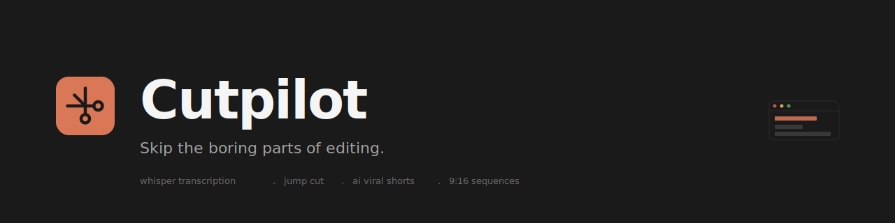

<p align="center">
  
</p>

<p align="center">
  <strong>Adobe Premiere Pro için AI editing asistanı.</strong><br>
  Düzenlemenin sıkıcı kısımlarını atla.
</p>

<p align="center">
  <a href="./README.md">English</a> ·
  <a href="https://buymeacoffee.com/ozeraksoy">Bana kahve ısmarla</a>
</p>

---

## Ne yapar

Cutpilot, Premiere Pro için saatlerce sürecek düzenleme işlerini dakikalara indiren bir CEP eklentisidir:

- **Whisper transkripsiyon** — kelime bazlı timestamp ile 15+ dilde
- **Frame-perfect jump cut** — sessizlikleri ve filler kelimeleri otomatik temizler
- **AI viral shorts** — uzun videodaki en iyi anları bulur, 9:16 dikey sekanslara dönüştürür
- **Otomatik altyazı senkronizasyonu** — jump-cut sekansınız için
- **Özelleştirilebilir** — filler kelimeler, sessizlik eşiği, AI modeli, aday sayısı

İçerik üreticileri için yapıldı — sessizlik kesmede daha az, üretmede daha çok zaman geçirin.

## Hızlı kurulum

### macOS

```bash
git clone https://github.com/ozeraksoy/cutpilot.git
cd cutpilot
chmod +x scripts/install.sh
./scripts/install.sh
```

### Windows

```bat
git clone https://github.com/ozeraksoy/cutpilot.git
cd cutpilot
scripts\install.bat
```

Kurulum scripti:
1. Eklentiyi Adobe CEP klasörünüze kopyalar
2. Premiere Pro debug modunu açar
3. FFmpeg kontrolü yapar (macOS'ta Homebrew ile kurabilir)

Kurulumdan sonra Premiere Pro'yu **tamamen** kapatıp yeniden açın. Cutpilot'u **Window > Extensions > Cutpilot** menüsünden bulabilirsiniz.

## Gereksinimler

- Adobe Premiere Pro 2019 veya sonrası (CC 13.0+)
- macOS veya Windows
- FFmpeg (macOS'ta kurulum scripti otomatik kurabilir)
- Whisper ve GPT-4o modellerine erişimi olan OpenAI API anahtarı

## Nasıl kullanılır

1. Premiere Pro'yu ve Cutpilot panelini aç
2. Sağ üst köşedeki çark ikonuna tıkla, OpenAI API anahtarını yapıştır
3. Timeline'da bir klip seç (veya "Tüm Klipler" ile aktif sekansı al)
4. **Transkripsiyon Başlat** — Whisper kelime bazlı doğrulukla transkript yapar
5. Sonra:
   - **Jump Cut** — sessizlikleri ve filler kelimeleri kaldırır, yeni sıkıştırılmış bir sekans oluşturur
   - **AI Viral Shorts** — videodaki en iyi anları bulur, yayına hazır 9:16 sekanslar oluşturur

Altyazılar otomatik senkronlanır. Viral adaylar kart halinde gösterilir, seçip onayladıktan sonra sekans üretilir.

## Diller

Arayüz Türkçe ve İngilizce destekler. Header'daki dropdown'dan geçiş yapın.

Whisper 15+ dilde transkripsiyon yapar: Türkçe, İngilizce, Almanca, Fransızca, İspanyolca, İtalyanca, Rusça, Arapça, Japonca, Korece, Çince, Portekizce, Hollandaca, Lehçe, İsveççe.

Çeviri de destekleniyor — kaynak dilde transkript yapıp aynı anda hedef dile çevirebilirsiniz.

## Ayarlar

Tüm ayarlar lokalde saklanır:

| Ayar | Aralık | Varsayılan |
|---|---|---|
| Minimum sessizlik | 100–1000ms | 300ms |
| Filler kelimeler | özelleştirilebilir liste | sey, ee, um, uh... |
| AI modeli | gpt-4o-mini / gpt-4o | gpt-4o-mini |
| Aday sayısı | 3–15 | 5 |
| Süre aralığı | 15–120sn | 25–90sn |

## Gizlilik

OpenAI API anahtarınız sadece bu cihazda localStorage üzerinden saklanır. Cutpilot, OpenAI API dışında hiçbir yere veri göndermez. Telemetri yok, analitik yok, hesap gerekmez.

## Yol haritası

- Auto-Reframe (9:16 için yüz takibi, center crop yerine)
- Daha fazla short efekti (text overlay, caption, geçiş efektleri)
- Adobe Marketplace listelenmesi (imzalı ZXP paketi)

## Katkı

Issue ve pull request'ler memnuniyetle karşılanır. Cutpilot MIT lisanslıdır.

Windows uyumluluk testlerine yardım edebilirseniz çok memnun olunur — proje şu an macOS'ta geliştiriliyor.

## Destek

Cutpilot size zaman kazandırdıysa [bana bir kahve ısmarlayabilirsiniz](https://buymeacoffee.com/ozeraksoy). Hata raporları ve özellik istekleri GitHub Issues üzerinden.

## Lisans

MIT — [LICENSE](./LICENSE) dosyasına bakın

---

[Ozer Aksoy](https://github.com/ozeraksoy) tarafından yapıldı.
